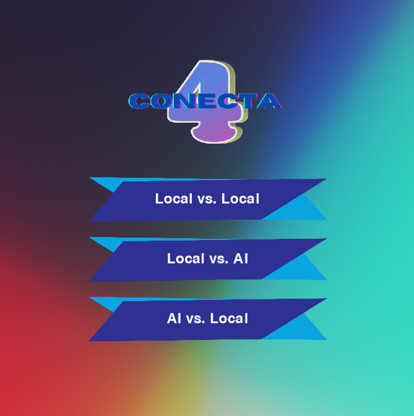
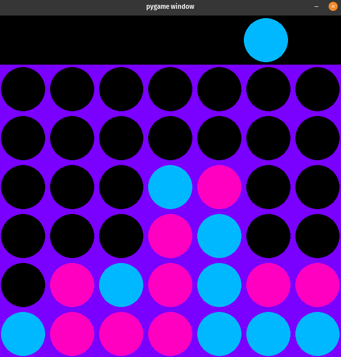

# Conecta4

Conecta4 is an interactive version of the classic Connect 4 game. Play against a friend locally or Try to beat the powerful AI. 
The project's main goal was to develop an artificial intelligence capable of winning against a human player. The AI uses the Alpha-Beta pruning search algorithm (based on minmax) with a special heuristic that assigns values to each cell on the board.

## Technologies Used

- Python 3.8.12
- Pygame 2.5.2
- Numpy 1.21.2

## Project Structure

- **Conecta4/**
  - `Search.py`: Implementation of the AI search algorithm.
  - `Utilities.py`: Contains necessary functions for the AI.
- **Main Files:**
  - `main.py`: Simple terminal-based implementation of the game.
  - `main_pygame.py`: Interactive version of the game using Pygame.

## Getting Started

- Make sure you have Python, Pygame, and Numpy installed.
- Run the game from the terminal using `python main_pygame.py`.

## Gameplay

- Play locally against a friend or challenge the AI.
- The game speed may vary depending on your computer's resources.

## How to Play

- Choose one of the three game modes: Local vs. Local, where you play locally against a friend; Local vs. AI, you challenge the AI and you have the first turn; IA vs. Local, where the AI starts playing.
- Connect four discs of your color in a row (vertically, horizontally, or diagonally).
- Players take turns dropping a disc into any of seven columns. Discs fall to the lowest available space in the chosen column.
- First to connect four discs wins. Tie if the board is full without a winner.
- Use mouse clicks to drop discs. Ctrl+B to return to the main menu. Ctrl+R to restart current game.

## AI Implementation

- The Connect 4 AI is based on the Alpha-Beta pruning algorithm, a variant of the Minimax search algorithm. This AI analyzes potential moves on the game board, assigning values using a specialized heuristic. The heuristic evaluates each cell's importance, guiding the AI to make strategic decisions.

## Demo / Screenshots

### Main menu:
  
### Game:
  

Enjoy playing Connect 4!
